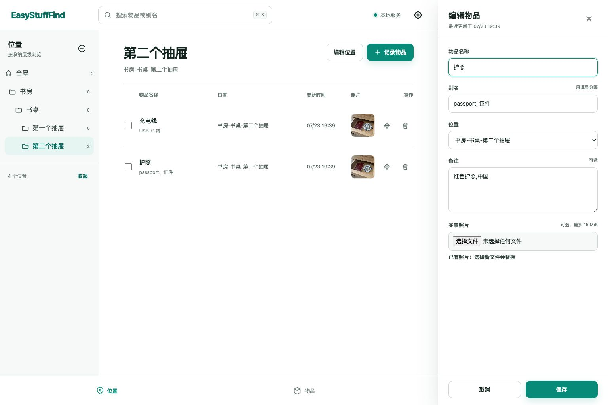
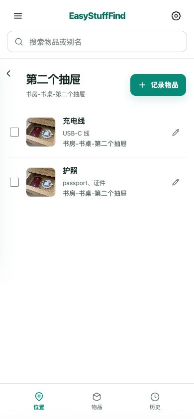

<div align="center">

# EasyStuffFind

**说一句，或拍一张，就记住家里的东西放在哪里。**

OpenClaw / 飞书优先 · 中文 Web 管理 · 本地 SQLite · 局域网自用

[快速开始](#快速开始) · [OpenClaw 接入](#openclaw-接入) · [主要能力](#主要能力) · [备份与恢复](#备份与恢复) · [API](#api) · [完整文档](#完整文档)

[](https://github.com/john-ops-lab/EasyStuffFind/releases/latest)


[](LICENSE)

</div>



<p align="center">
  
</p>

## 为什么需要 EasyStuffFind？

东西收好后找不到，往往不是没有整理，而是整理完成时没有顺手留下记录。

EasyStuffFind 把记录动作缩短成一句话或一张照片：

```text
护照放书房书桌第二个抽屉了
```

OpenClaw 负责理解自然语言和飞书消息，EasyStuffFind 负责可靠保存位置、照片与
移动历史。以后问“护照在哪”，就能得到完整位置、更新时间和实景照片。

所有数据默认保存在家里的 Mac mini，不需要公网账号，也不依赖外部数据库。

## 主要能力

| 能力 | 说明 |
| --- | --- |
| 🗣️ 一句话记录 | 按 `书房-书桌-第二个抽屉` 自动创建位置树并记录物品 |
| 📷 拍照记录 | 一物一张当前位置实景照片，查询时返回短时签名 URL |
| 🔎 名称与别名查询 | 唯一命中、多候选、无结果三种状态明确返回，不猜测 |
| 🗂️ 位置树 | 任意层级折叠、展开和按位置反查，折叠状态刷新后保留 |
| 🧠 物品脑图 | 默认展示前两级位置，可逐级展开到物品详情 |
| ↔️ 移动与历史 | 记录原位置、新位置和变更时间，Web 支持批量移动 |
| 🔍 照片查看 | 默认适应窗口，支持 50%–300% 缩放 |
| 🔐 分离认证 | Web 使用 30 天管理员会话，Agent 使用独立长期 token |
| 💾 自动备份 | 支持手工、每日、每周、每月本地备份和按日期恢复 |
| ☁️ 公有云同步 | 支持阿里云 OSS、腾讯云 COS 和通用 S3 私有 Bucket |
| 🤖 Agent 自助安装 | 仓库自带 OpenClaw Skill、对接脚本和闭环自检 |

## 快速开始

### 环境要求

- macOS 或 Linux
- Docker 与 Docker Compose
- 端口 `8733` 未被占用
- 数据目录可由当前用户读写

完整的 Agent 无人值守安装步骤与故障处理见 [INSTALL.md](INSTALL.md)。

### 启动

```bash
git clone https://github.com/john-ops-lab/EasyStuffFind.git
cd EasyStuffFind
docker compose up -d --build
python3 scripts/wait_for_health.py
```

验证“记录 → 查询 → 删除”闭环：

```bash
python3 scripts/self_check.py \
  --base-url http://127.0.0.1:8733 \
  --token-file data/api-token
```

打开 [http://127.0.0.1:8733](http://127.0.0.1:8733)。

Web 初始账号和密码均为 `admin`，登录状态保持 30 天。首次登录后请在右上角
“账户设置”中修改密码。API token 只供 OpenClaw/Agent 使用，不需要复制到浏览器。

停止服务不会删除数据：

```bash
docker compose down
```

## OpenClaw 接入

仓库自带 [EasyStuffFind Skill](skills/openclaw/SKILL.md)，覆盖记录、查询、拍照、
移动、消歧和中文确认话术。对接只绑定当前 agent，不会给其他 agent 扩权，也不会
把 token 明文写进 OpenClaw 配置。

### 场景一：让 OpenClaw 安装并对接

适用于已经安装 OpenClaw、但还没有 EasyStuffFind。把下面这段话发送给需要使用
EasyStuffFind 的 agent：

```text
请安装并对接这个家庭物品位置工具：
https://github.com/john-ops-lab/EasyStuffFind

请严格按照仓库根目录 INSTALL.md 的 5 个步骤执行：完成前置检查、启动服务、
运行记录→查询→删除自检，并把仓库中的 EasyStuffFind Skill 只绑定到当前对话
所属的 agent。不要授权其他 agent，不要显示或复制 token 明文，不要暴露公网。
只有健康检查、自检、目标 agent 可见性和认证查询全部通过后，才向我声明完成。
```

OpenClaw 会克隆仓库、启动服务、读取 `data/api-token` 的文件引用、安装 Skill，
并验证当前 agent 从下一条消息开始可以直接记录和查询。

### 场景二：服务已经运行，再让 OpenClaw 对接

适用于 EasyStuffFind 已经通过 Docker 或本机进程运行，之后才安装 OpenClaw。
把下面这段话发送给需要使用它的 agent：

```text
请把当前 OpenClaw agent 对接到本机已经运行的 EasyStuffFind。

EasyStuffFind 项目目录：<本机 EasyStuffFind 项目绝对路径>
服务地址：http://127.0.0.1:8733
token 文件：<本机 EasyStuffFind 项目绝对路径>/data/api-token

服务已经安装并运行，不要重新安装或重启 EasyStuffFind，不要重启 OpenClaw
Gateway，不要显示或复制 token 明文。请读取项目中的 INSTALL.md 和
skills/openclaw/SKILL.md，从当前 OpenClaw 运行上下文取得你自己的 agent ID，
然后在项目目录执行：

python3 scripts/configure_openclaw.py \
  --base-url http://127.0.0.1:8733 \
  --token-file data/api-token \
  --agent "<当前 agent ID>"

必须确认健康检查、认证查询、OpenClaw 配置校验以及当前 agent 的 Skill 可见性
全部通过。只绑定当前 agent，不要修改其他 agent。
```

使用 OpenClaw 命名 profile 时，由 agent 从自己的运行环境取得 profile，并追加
`--profile "<当前 profile>"`。共同成功标志为：

```text
PASS OpenClaw 对接完成；agent=<当前 agent ID>；下一轮对话起可直接使用；
token 仅由文件路径引用，未写入配置明文。
```

## 备份与恢复

Web 底部“备份”页面支持：

- 立即创建本地 ZIP 备份；
- 每日、每周、每月定时执行；
- 本地保留 7、30、90 天或永久；
- 同步到阿里云 OSS、腾讯云 COS 或通用 S3 公有云服务中的私有 Bucket；
- 按日期下载、上传和恢复备份；
- 恢复前验证当前管理员密码并再次手工确认；
- 覆盖前自动创建紧急备份。

Web 恢复只覆盖位置、物品、历史和照片，保留当前管理员账号与密码、API token、
云配置和定时设置。备份包本身不加密；云端必须使用私有 Bucket、HTTPS 和服务端
AES-256 加密。云凭据只保存在权限为 `0600` 的本地配置文件中，不进入备份包。

完整操作与 CLI 灾备路径见
[备份与恢复 Runbook](docs/runbooks/backup-and-restore.md)。

## 数据与安全

完整运行数据位于：

```text
data/
├── api-token
├── backup-config.json
├── backups/
├── easystufffind.sqlite3
└── photos/
```

- SQLite 数据库和照片目录一起复制即可完成离线迁移。
- token 首次启动自动生成，文件权限为 `0600`。
- 日志只记录 token 文件路径和不可逆 SHA-256 指纹，不打印凭据。
- 照片 URL 使用 HMAC 短时签名，默认一小时过期，不包含长期 token。
- 备份管理只接受 Web 管理员会话，Agent token 无权访问。
- 服务定位为家庭局域网工具，不要配置公网端口转发或公网反向代理。

## API

REST API 是一等公民，不依赖 Web 页面才能使用：

- 健康检查：`GET /health`
- 交互文档：`http://127.0.0.1:8733/docs`
- 机器契约：[contracts/openapi.json](contracts/openapi.json)
- 业务接口前缀：`/api/v1`
- Agent 认证：`Authorization: Bearer <token>`
- v1 兼容原则：已发布字段只增不减

## 从源码运行

支持 Python 3.12–3.14：

```bash
python3 -m venv .venv
.venv/bin/python -m pip install -r requirements.lock
.venv/bin/python -m easystufffind
```

本地等价验证：

```bash
.venv/bin/python -m compileall -q easystufffind scripts tests skills/openclaw/scripts
.venv/bin/python -m unittest discover -s tests -v
.venv/bin/python scripts/export_openapi.py --check
.venv/bin/python scripts/validate_skill.py skills/openclaw
.venv/bin/python -m pip check
```

当前自动化覆盖位置树、三种查询状态、同名消歧、移动历史、照片联动、Web 登录、
OpenClaw agent 最小绑定、定时备份、双确认恢复，以及真实 S3 兼容问题的回归测试。

## 项目结构

```text
EasyStuffFind
├── easystufffind/       # FastAPI、SQLite、备份服务和中文 Web
├── scripts/             # 自检、契约、OpenClaw 对接和灾备工具
├── skills/openclaw/     # 随仓库分发的 OpenClaw Skill
├── tests/               # 单元测试与隔离 live API 测试
├── contracts/           # 固化的 OpenAPI 机器契约
└── docs/                # PRD、架构、ADR、运维和故障记录
```

## 完整文档

- [安装与无人值守对接](INSTALL.md)
- [产品需求](docs/product/PRD.md)
- [系统架构](docs/architecture.md)
- [运行与交付](docs/operations.md)
- [备份与恢复](docs/runbooks/backup-and-restore.md)
- [发布与回滚](docs/runbooks/release-and-rollback.md)
- [项目状态](docs/project-status.md)

## License

Released under the [MIT License](LICENSE).

---

<div align="center">
  Built for calmer, easier-to-find homes.
</div>
