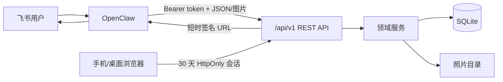

# EasyStuffFind 系统架构

最后更新：2026-07-24

## 1. 系统边界

### 系统负责

- 位置树、物品、别名、备注、当前位置和移动历史的持久化。
- 本地照片归档、当前照片替换与签名访问。
- 供 OpenClaw 使用的版本化 REST API。
- 供家庭成员使用的中文 Web 管理界面。
- Agent token 自举、Web 单账号会话、健康检查、自检、定时备份、公有云对象存储
  私有 Bucket 同步和双确认恢复。

### 系统不负责

- 飞书消息接收、自然语言解析、图片下载和对话式追问。
- 用户体系、公网防护、统计分析和多位置物品建模。

## 2. 主要组件

| 组件 | 职责 | 输入 | 输出 |
|---|---|---|---|
| FastAPI 应用 | 路由、认证、错误模型、OpenAPI | HTTP | JSON/静态文件/图片 |
| 领域服务 | 位置解析、upsert、查询评分、移动和照片流程 | 已校验命令 | 领域对象或明确冲突 |
| SQLite 存储 | 事务、Schema、CRUD、历史 | 领域操作 | 持久化记录 |
| 照片存储 | 原子写入、替换、删除 | 图片字节 | 数据目录中的文件 |
| Web 管理端 | 中文位置/物品/脑图/历史管理 | v1 API | 响应式 UI |
| 运维脚本 | 自检、契约导出、备份与隔离恢复 | 服务或数据目录 | 可验证结果 |
| 备份服务 | SQLite 在线快照、ZIP 清单校验、调度、保留与安全恢复 | 数据目录/Web 命令 | 本地或云端备份 |
| S3 兼容适配器 | 阿里云 OSS、腾讯云 COS、通用 S3 私有桶 | HTTPS + 本地凭据文件 | 服务端加密对象 |

## 3. 关键数据流

## 4. 数据模型

- `locations`：自关联树；同一父节点下名称唯一。
- `items`：允许重名；别名以 JSON 数组存储；只保存一个 `location_id` 和一张当前照片元数据。
- `location_history`：物品移动时写入；同时保存旧/新位置 ID 与路径快照。
- `web_accounts`：固定单管理员账号的 scrypt 密码哈希、认证版本和改密时间。
- `PRAGMA user_version`：Schema 版本权威标记；启动时只执行向前迁移。

SQLite 使用 WAL、外键、busy timeout；每次业务写入在显式事务中完成。家庭量级查询允许在内存中对千级物品做 Unicode 归一化和包含匹配，避免引入 FTS/ORM 依赖。

## 5. 认证与照片 URL

- 首次启动以原子独占创建方式生成 256 位以上随机 token，写入 `<data>/api-token`，模式 `0600`。
- OpenClaw/Agent 使用 `Authorization: Bearer`，以恒定时间比较 token。
- Web 默认账号/密码为 `admin/admin`；密码以 scrypt 哈希存储，浏览器使用由本地 token
  派生 HMAC 签名的 30 天 HttpOnly、SameSite=Strict Cookie。修改密码会递增认证版本，
  使旧会话立即失效。
- 日志只记录 token 文件路径与完整 SHA-256 指纹。
- 照片 URL 参数为 `expires` 和 `signature`；签名是以 token 为 HMAC 密钥对照片 ID 与过期时间计算的 SHA-256，不包含 token。
- 过期时间最多为签发后一小时；删除或替换照片后旧 URL 因记录/文件变化失效。

## 6. API 与兼容

- 权威来源：FastAPI 路由和 Pydantic 模型。
- 固化契约：`scripts/export_openapi.py` 生成 `contracts/openapi.json`。
- 兼容：所有业务路径位于 `/api/v1`；v1 已有字段只增不减；破坏性变化必须进入 v2。
- 查询统一返回 `status: unique | multiple | none`、`query`、`count`、`item` 或 `candidates`。
- 无 ID upsert 通过名称/别名唯一命中时保留主名称，并对请求未提供的别名/备注执行非破坏性保留；显式改名走 PATCH 或带 ID upsert。

## 7. 外部依赖决策

| 依赖 | 用途 | 固定版本 | 选择理由与回滚 |
|---|---|---:|---|
| FastAPI | API、验证、OpenAPI、静态路由 | 0.139.2 | 官方维护，Python 3.12 兼容；回滚锁文件与应用提交 |
| Uvicorn | 单进程 ASGI 服务 | 0.51.0 | 官方 ASGI 服务器；不使用 `standard` extra 以减少依赖 |
| boto3 | S3 兼容云对象存储 | 1.43.55 | 单一接口覆盖 OSS/COS/S3；固定完整传递依赖，删除云同步即可回滚 |

未采用 SQLAlchemy/Alembic：本期 Schema 小、单 SQLite 文件、迁移线性，标准库事务和 `user_version` 足够。未采用 React/Vite：用户明确要求前端从简和依赖少，原生 Web 可以完成当前管理工作流，避免 Node 构建链。

## 8. 目录职责

| 目录 | 职责 | 禁止事项 |
|---|---|---|
| `easystufffind/` | 应用与静态 UI | 读取真实开发机数据 |
| `tests/` | 隔离测试 | 使用仓库 `data/` |
| `scripts/` | 运维与契约工具 | 输出 Secret |
| `contracts/` | 生成后的机器契约 | 手写漂移 |
| `skills/openclaw/` | OpenClaw 集成契约 | 嵌入真实地址或 token |

OpenClaw 对接采用当前 agent 最小授权：安装器优先通过仓库所在 workspace
识别正在执行安装的 agent，也接受 agent 自行传入其运行时 ID。Skill 只写入该
agent workspace；仅当该 agent 存在显式 Skill allowlist 时追加
`easystufffind`。配置和 Skill 由 OpenClaw 热加载，安装器不得批量授权或主动重启
承载当前对话的 Gateway。
| `data/` | 运行数据 | 进入版本控制 |

## 9. 质量属性与风险

- 可用性：单容器、restart policy、健康检查、无外部服务依赖。
- 一致性：SQLite 事务；照片临时文件 + 原子替换；失败不覆盖旧照片。
- 性能：千级物品/万级文件；无高并发目标。
- 安全：局域网边界 + Agent token + Web 签名会话；无公网安全承诺；签名照片 URL 可在有效期内转发。
- 可恢复：数据库使用 SQLite backup API；照片与 SHA-256 清单一起写入 ZIP。Web
  恢复持有进程内互斥锁，保留当前身份配置，并在覆盖前生成紧急备份；完整灾备
  仍可按 CLI 停服恢复。
- 已知风险：开发机当前没有 Docker，因此容器实跑需在具备 Docker 的环境补验。
